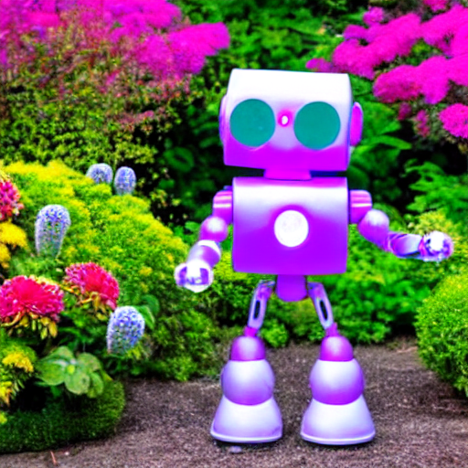

# PRODIGY_GA_02 - Image Generation with Pre-trained Models

## Generative AI Internship - Prodigy Infotech

This project is completed as part of my Generative AI Internship at Prodigy Infotech.

## About the Task

The main objective of this task was to generate images using a pre-trained Generative AI model.

For this task, I used the Stable Diffusion v1.5 model with the Hugging Face Diffusers library. The model takes a text prompt as input and generates an image according to the description.

## Tools and Technologies Used

- Python
- Google Colab
- PyTorch
- Hugging Face Diffusers
- Hugging Face Transformers
- Stable Diffusion
- GPU (CUDA)

## Model Used

I used the pre-trained Stable Diffusion v1.5 model:

`runwayml/stable-diffusion-v1-5`

The model was loaded using the Hugging Face Diffusers library and was run on a GPU in Google Colab.

## What I Did

First, I installed the required libraries and configured Google Colab to use a GPU.

After that, I loaded the pre-trained Stable Diffusion model and created different text prompts.

The prompts were then passed to the model to generate images. The generated images were saved as PNG files and displayed in the notebook.

## Prompts Used

### Prompt 1

A futuristic city at sunset, with flying cars, tall glass buildings, neon lights, and a beautiful sky

### Prompt 2

A peaceful mountain landscape with a crystal-clear lake, green forests, snow-covered peaks, and a dramatic sky

### Prompt 3

A cute robot exploring a colorful futuristic garden, surrounded by flowers and glowing plants

## Generated Images

### Image 1

### Image 2

### Image 3

## Result

The model successfully generated images from all three text prompts.

The results showed that Stable Diffusion can understand natural language descriptions and generate corresponding images.

## Project Files

- `PRODIGY_GA_02_Image_Generation.ipynb` - Google Colab notebook containing the complete implementation.
- `generated_image_1.png` - Image generated from the first prompt.
- `generated_image_2.png` - Image generated from the second prompt.
- `generated_image_3.png` - Image generated from the third prompt.
- `requirements.txt` - Required Python libraries.

## Conclusion

This task helped me understand the practical use of Generative AI for text-to-image generation. I learned how to load a pre-trained Stable Diffusion model, create text prompts, generate images, and save the generated results.

## Internship Details

**Organization:** Prodigy Infotech

**Internship:** Generative AI Internship

**Task:** Task 02 - Image Generation with Pre-trained Models

**Platform:** Google Colab

**Model:** Stable Diffusion v1.5

## Author

**Sumit Singh Bisht**
